---
# Preamble

## Author
author:
  name: Мантуров Татархан Бесланович
  degrees: DSc
  orcid: 0000-0002-0877-7063
  email: kulyabov-ds@rudn.ru
  affiliation:
    - name: Российский университет дружбы народов
      country: Российская Федерация
      postal-code: 117198
      city: Москва
      address: ул. Миклухо-Маклая, д. 6
## Title
title: "Отчёт по лабораторной работе №5"
subtitle: "Дисциплина: Сетевые технологии"
license: "CC BY"
## Generic options
lang: ru-RU
number-sections: true
toc: true
toc-title: "Содержание"
toc-depth: 2
## Crossref customization
crossref:
  lof-title: "Список иллюстраций"
  lot-title: "Список таблиц"
  lol-title: "Листинги"
## Bibliography
bibliography:
  - bib/cite.bib
csl: _resources/csl/gost-r-7-0-5-2008-numeric.csl
## Formats
format:
### Pdf output format
  pdf:
    toc: true
    number-sections: true
    colorlinks: false
    toc-depth: 2
    lof: true # List of figures
    lot: true # List of tables
#### Document
    documentclass: scrreprt
    papersize: a4
    fontsize: 12pt
    linestretch: 1.5
#### Language
    babel-lang: russian
    babel-otherlangs: english
#### Biblatex
    cite-method: biblatex
    biblio-style: gost-numeric
    biblatexoptions:
      - backend=biber
      - langhook=extras
      - autolang=other*
#### Misc options
    csquotes: true
    indent: true
    header-includes: |
      \usepackage{indentfirst}
      \usepackage{float}
      \floatplacement{figure}{H}
      \usepackage[math,RM={Scale=0.94},SS={Scale=0.94},SScon={Scale=0.94},TT={Scale=MatchLowercase,FakeStretch=0.9},DefaultFeatures={Ligatures=Common}]{plex-otf}
### Docx output format
  docx:
    toc: true
    number-sections: true
    toc-depth: 2
---

# Цель работы

Целью данной работы является построение простейших моделей сети на базе коммутатора и маршрутизаторов FRR и VyOS в GNS3, анализ трафика посредством Wireshark

# Задание

1. Построить в GNS3 топологию сети, состоящей из коммутатора Ethernet и двух оконечных устройств (персональных компьютеров).
2. Задать оконечным устройствам IP-адреса в сети 192.168.1.0/24. Проверить связь.
3. С помощью Wireshark захватить и проанализировать ARP-сообщения.
4. С помощью Wireshark захватить и проанализировать ICMP-сообщения.
5. Построить в GNS3 топологию сети, состоящей из маршрутизатора FRR, коммутатора Ethernet и оконечного устройства. Задать оконечному устройству IP-адрес в сети 192.168.1.0/24. Присвоить интерфейсу маршрутизатора адрес 192.168.1.1/24. Проверить связь.
6. Построить в GNS3 топологию сети, состоящей из маршрутизатора VyOS, коммутатора Ethernet и оконечного устройства. Задать оконечному устройству IP-адрес в сети 192.168.1.0/24. Присвоить интерфейсу маршрутизатора адрес 192.168.1.1/24. Проверить связь.

# Выполнение лабораторной работы

## Моделирование простейшей сети на базе коммутатора в GNS3

Запустили GNS3 VM и GNS3. Создали новый проект ([рис. @fig-001]) 

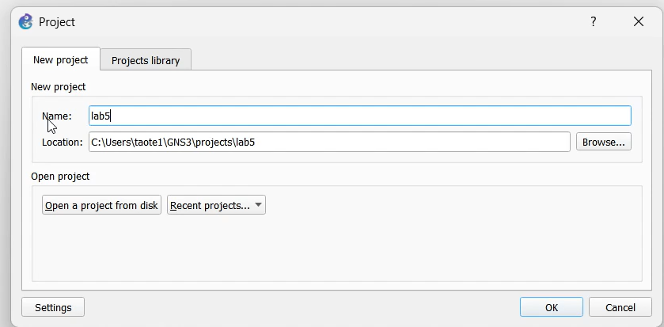{#fig-001 width=70%}

В рабочей области GNS3 разместили коммутатор Ethernet и два VPCS. Щёлкнув на устройстве правой кнопкой мыши выбереали в меню "Configure". Изменили название устройства, включив в имя устройства имя нашей учётной записи. Коммутатору присвоили название *msk-tbmanturov-sw-01*. Соединили VPCS с коммутатором ([рис. @fig-002]) 

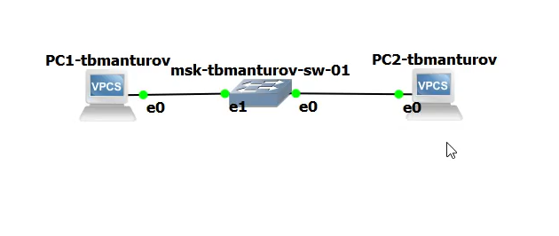{#fig-002 width=70%}

Задали IP-адреса VPCS. Для этого с помощью меню, вызываемого правой кнопкой мыши, запустили "Start", например, PC-1, затем вызовали его терминал "Console". Для просмотра синтаксиса возможных для ввода команд набрали ```/?``` ([рис. @fig-003]) 

Для задания IP-адреса 192.168.1.11 в сети 192.168.1.0/24 ввели: ```ip 192.168.1.11/24 192.168.1.1```. А для сохранения конфигурации ввели команду ```save``` ([рис. @fig-004])

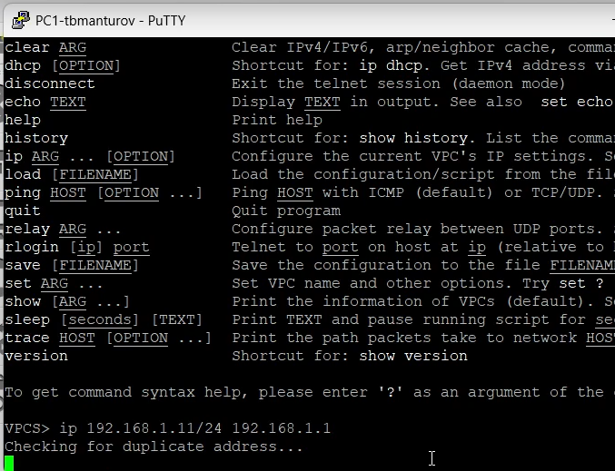{#fig-004 width=70%}

Аналогичным образом задали IP-адрес 192.168.1.12 для PC-2: ```ip 192.168.1.12/24 192.168.1.1``` ([рис. @fig-005])

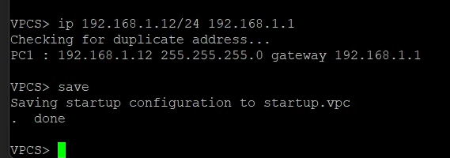{#fig-005 width=70%}

Далее проверили работоспособность соединения между PC-1 и PC-2 с помощью команды ping: ```ping 192.168.1.12``` и ```ping 192.168.1.11``` ([рис. @fig-006]), ([рис. @fig-007])

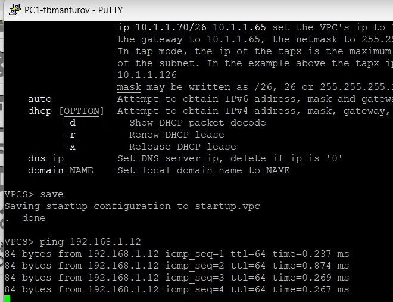{#fig-006 width=70%}

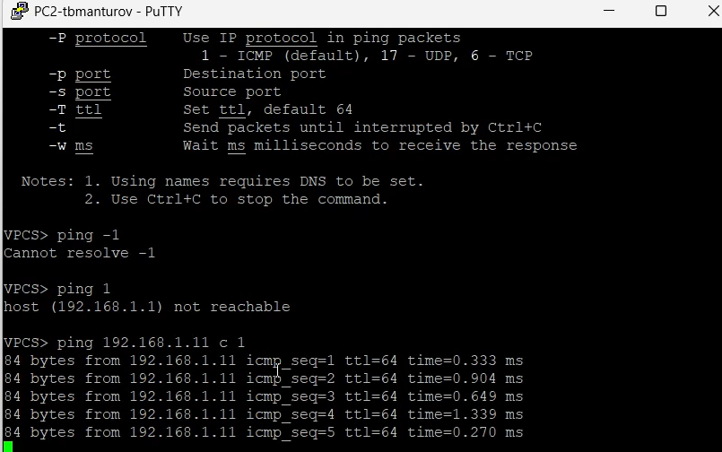{#fig-007 width=70%}

После остановили в проекте все узлы (меню GNS3 "Control" -> "Stop all nodes") ([рис. @fig-008])

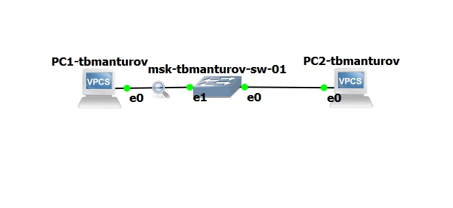{#fig-008 width=70%}

## Анализ трафика в GNS3 посредством Wireshark

Запустили на соединении между PC-1 и коммутатором анализатор трафика. Для этого щёлкнули правой кнопкой мыши на соединении, выберали в меню "Start capture". Запустился Wireshark, а в проекте GNS3 на соединении появился значок лупы ([рис. @fig-009])

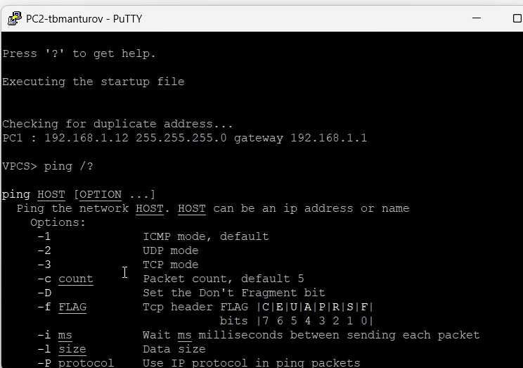{#fig-009 width=70%}

В проекте GNS3 стартовали все узлы (меню GNS3 "Control" -> "Start/Resume all nodes"). В окне Wireshark отобразилась информация по протоколу ARP ([рис. @fig-010]), ([рис. @fig-011])

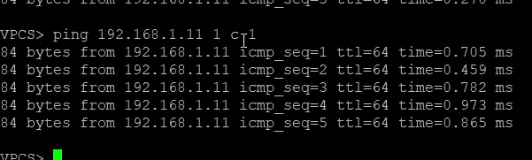{#fig-011 width=70%}

Устройства в сети выполняют стандартную инициализацию:

- Ищут маршрутизаторы для IPv6 конфигурации

- Объявляют свои IPv4 адреса через ARP для обновления кэшей соседей

- Проверяют уникальность IP-адресов в сети

Оба устройства отправляют ARP-запросы для определения MAC-адресов устройств, чей IP-адрес им уже известен.

В терминале PC-2 посмотрели информацию по опциям команды ping, введя ```ping /?``` ([рис. @fig-012])

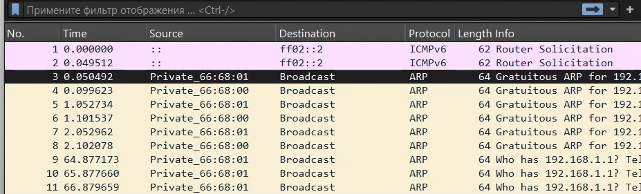{#fig-012 width=70%}

Затем сделали один эхо-запрос в ICMP-моде к узлу PC-1: ```ping 192.168.1.11 -1 -c 1``` ([рис. @fig-013]), ([рис. @fig-014])

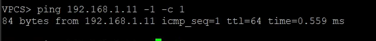{#fig-013 width=70%}

{#fig-014 width=70%}

**Анализ полученной информации:**

Основные параметры:

- Тип: 8 (Echo Request - запрос)

- От кого: 192.168.1.12 (PC-2)

- Кому: 192.168.1.11 (PC-1)

Содержание пакета:

- Sequence Number: 1 (порядковый номер)

- TTL: 64 (время жизни пакета)

- Данные: 56 байт тестовых данных

Процесс:

- PC-2 отправляет Echo Request на PC-1

- PC-1 получает запрос

- PC-1 отправляет обратно Echo Reply

Затем сделали один эхо-запрос в UDP-моде к узлу PC-1: ```ping 192.168.1.11 -2 -c 1``` ([рис. @fig-015]), ([рис. @fig-016])

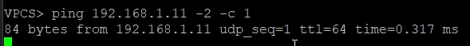{#fig-015 width=70%}


**Анализ полученной информации:**

Основные параметры:

- Протокол: UDP 

- От кого: 192.168.1.12 (PC-2)

- Кому: 192.168.1.11 (PC-1)

- Порты:

	+ Source Port: 5360

	+ Destination Port: 7 (Echo порт)

Процесс:

- PC-2 отправляет UDP-пакет на порт 7 PC-1

- Если на PC-1 запущен Echo-сервер, он отвечает тем же пакетом

- Ответ виден в пакете 18

Затем сделали один эхо-запрос в TCP-моде к узлу PC-1: ```ping 192.168.1.11 -3 -c 1``` ([рис. @fig-017]), ([рис. @fig-018])

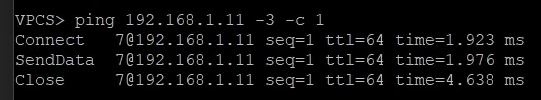{#fig-017 width=70%}

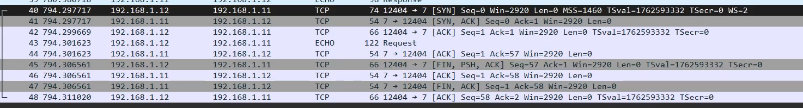{#fig-018 width=70%}

Для отправки TCP-пакета сначала выполняется процедура трехстороннего рукопожатия (TCP handshake), которое подробнее разбиралось в лабораторной работе No3. После установления соединения отправляется сам эхо-запрос.

**Анализ полученной информации:**

Three-Way Handshake (пакеты 21-23):

- SYN (21): PC-2 → PC-1 - запрос на соединение

- SYN-ACK (22): PC-1 → PC-2 - подтверждение + запрос

- ACK (23): PC-2 → PC-1 - окончательное подтверждение

Отправка данных (пакет 24):

- Протокол: TCP

- Порты: 35393 → 7 (Echo порт)

- Флаги: PSH, ACK (протолкнуть данные + подтверждение)

- Данные: 56 байт полезной нагрузки

Подтверждение данных (пакет 25):

- PC-1 подтверждает получение данных

Завершение соединения (пакеты 26-29):

- FIN (26): PC-2 запрашивает закрытие

- ACK (27): PC-1 подтверждает

- FIN (28): PC-1 также закрывает соединение

- ACK (29): PC-2 финальное подтверждение

После остановили захват пакетов в Wireshark.

## Моделирование простейшей сети на базе маршрутизатора FRR в GNS3

Запустили GNS3 VM и GNS3. Создали новый проект ([рис. @fig-019]) 

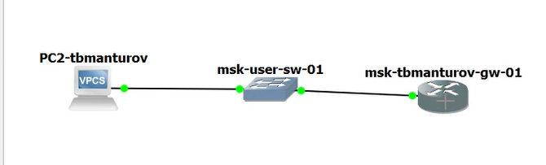{#fig-019 width=70%}

В рабочей области GNS3 разместили VPCS, коммутатор Ethernet и маршрутизатор FRR. Коммутатору присвоили название *msk-tbmanturov-sw-01*, маршрутизатору - *msk-tbmanturov-gw-01*, VPCS - *PC1-tbmanturov*. Включили захват трафика на соединении между коммутатором и маршрутизатором. Запустили все устройства проекта ([рис. @fig-020])

{#fig-020 width=70%}

Открыли консоли всех устройств проекта. Настроили IP-адресацию для интерфейса узла PC1 ([рис. @fig-021]):

```ip 192.168.1.10/24 192.168.1.1```

```save```

```show ip```

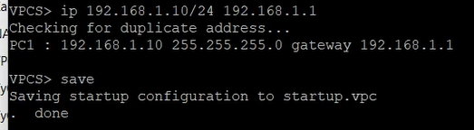{#fig-021 width=70%}

Настроили IP-адресацию для интерфейса локальной сети маршрутизатора ([рис. @fig-022]):

```
frr# configure terminal
frr(config)# hostname msk-tbmanturov-gw-01
msk-tbmanturov-gw-01(config)# exit
msk-tbmanturov-gw-01# write memory
msk-ustbmanturover-gw-01# configure terminal
msk-tbmanturov-gw-01(config)# interface eth0
msk-tbmanturov-gw-01(config-if)# ip address 192.168.1.1/24
msk-tbmanturov-gw-01(config-if)# no shutdown
msk-tbmanturov-gw-01(config-if)# exit
msk-tbmanturov-gw-01(config)# exit
msk-tbmanturov-gw-01# write memory
```

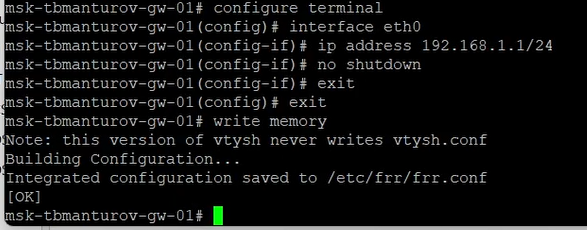{#fig-022 width=70%}

Далее проверили конфигурацию маршрутизатора и настройки IP-адресации ([рис. @fig-023]):

```msk-tbmanturov-gw-01# show running-config```

```msk-tbmanturov-gw-01# show interface brief```

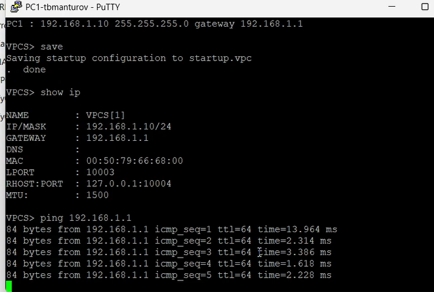{#fig-023 width=70%}

Проверили подключение с помощью ```ping 192.168.1.1```. Узел PC1 успешно отправляет эхо-запросы
на адрес маршрутизатора 192.168.1.1 ([рис. @fig-024]) 

{#fig-024 width=70%}

Посмотрели информацию в окне wireshark. Связь с маршрутизатором FRR работает идеально - все ping-запросы успешно доставляются и получают ответы, ARP-таблицы корректно обновляются с обеих сторон ([рис. @fig-025])

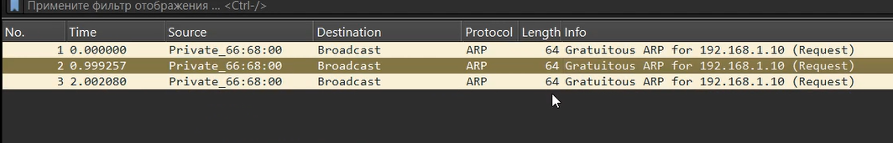{#fig-025 width=70%}

После этого остановили захват пакетов в Wireshark. Остановили все устройства в проекте

## Моделирование простейшей сети на базе маршрутизатора VyOS в GNS3

Запустили GNS3 VM и GNS3. Создали новый проект ([рис. @fig-026]) 

В рабочей области GNS3 разместили VPCS, коммутатор Ethernet и маршрутизатор VyOS. Коммутатору присвоили название *msk-tbmanturov-sw-01*, маршрутизатору - *msk-tbmanturov-gw-01*, VPCS - *PC1-tbmanturov*. Включили захват трафика на соединении между коммутатором и маршрутизатором. Запустили все устройства проекта ([рис. @fig-027])

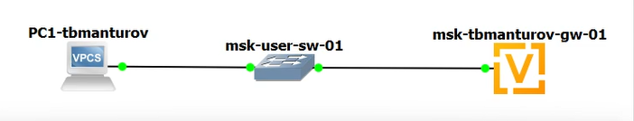{#fig-027 width=70%}

Открыли консоли всех устройств проекта. Настроили IP-адресацию для интерфейса узла PC1 ([рис. @fig-028]):

```ip 192.168.1.10/24 192.168.1.1```

```save```

```show ip```

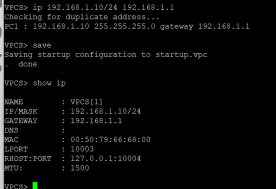{#fig-028 width=70%}

Далее натроили маршрутизатор VyOS. После загрузки введите логин vyos и пароль vyos. В рабочем режиме в командной строке отображается символ $ ([рис. @fig-029])

- Перешли в режим конфигурирования: ```vyos@vyos$ configure```

- Изменили имя устройства: ```vyos@vyos#set system host-name msk-tbmanturov-gw-01```

- Задали IP-адрес на интерфейсе eth0: ```vyos@vyos# set interfaces ethernet eth0 address 192.168.1.1/24```

- Посмотрели внесённые в конфигурацию изменения: ```vyos@vyos# compare```

- Приняли изменения в конфигурации и сохранили саму конфигурацию: ```vyos@vyos# commit``` и ```vyos@vyos# save```

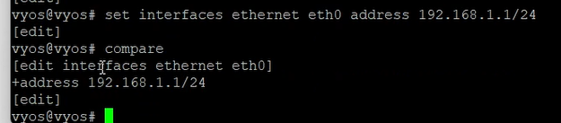{#fig-031 width=70%}

Посмотрели информацию об интерфейсах маршрутизатора: ```vyos@vyos# show interfaces```. А после вышли из режима конфигурирования: ```vyos@vyos# exit``` ([рис. @fig-032])  

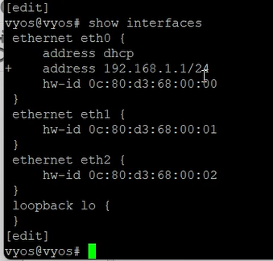{#fig-032 width=70%}

Проверили подключение с помощью ```ping 192.168.1.1```. Узел PC1 успешно отправляет эхо-запросы
на адрес маршрутизатора 192.168.1.1 ([рис. @fig-033]) 

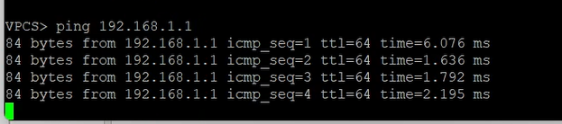{#fig-033 width=70%}

Посмотрели информацию в окне wireshark. Связь с маршрутизатором VyOS работает отлично - все ping-запросы успешно доставляются ([рис. @fig-034])

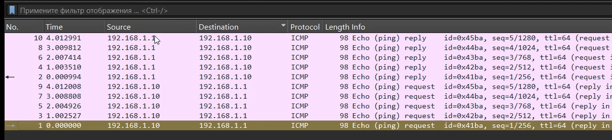{#fig-034 width=70%}

После этого остановили захват пакетов в Wireshark. Остановили все устройства в проекте. Завершили работу с GNS3.

# Выводы

В ходе выполнения лабораторной работы №5 мы научились строить простейшие модели сети на базе коммутатора и маршрутизаторов FRR и VyOS в GNS3. Проанализировали трафик посредством Wireshark.

# Список литературы

1. [Лаборатораня работа №5](https://esystem.rudn.ru/pluginfile.php/2858375/mod_resource/content/2/005-lab_datalink-layer-GNS3-WSh.pdf)
