---
# Preamble

## Author
author:
  name: Мантуров Татархан Бесланович
  degrees: DSc
  orcid: 0000-0002-0877-7063
  email: kulyabov-ds@rudn.ru
  affiliation:
    - name: Российский университет дружбы народов
      country: Российская Федерация
      postal-code: 117198
      city: Москва
      address: ул. Миклухо-Маклая, д. 6
## Title
title: "Отчёт по лабораторной работе №7"
subtitle: "Дисциплина: Сетевые технологии"
license: "CC BY"
## Generic options
lang: ru-RU
number-sections: true
toc: true
toc-title: "Содержание"
toc-depth: 2
## Crossref customization
crossref:
  lof-title: "Список иллюстраций"
  lot-title: "Список таблиц"
  lol-title: "Листинги"
## Bibliography
bibliography:
  - bib/cite.bib
csl: _resources/csl/gost-r-7-0-5-2008-numeric.csl
## Formats
format:
### Pdf output format
  pdf:
    toc: true
    number-sections: true
    colorlinks: false
    toc-depth: 2
    lof: true # List of figures
    lot: true # List of tables
#### Document
    documentclass: scrreprt
    papersize: a4
    fontsize: 12pt
    linestretch: 1.5
#### Language
    babel-lang: russian
    babel-otherlangs: english
#### Biblatex
    cite-method: biblatex
    biblio-style: gost-numeric
    biblatexoptions:
      - backend=biber
      - langhook=extras
      - autolang=other*
#### Misc options
    csquotes: true
    indent: true
    header-includes: |
      \usepackage{indentfirst}
      \usepackage{float}
      \floatplacement{figure}{H}
      \usepackage[math,RM={Scale=0.94},SS={Scale=0.94},SScon={Scale=0.94},TT={Scale=MatchLowercase,FakeStretch=0.9},DefaultFeatures={Ligatures=Common}]{plex-otf}
### Docx output format
  docx:
    toc: true
    number-sections: true
    toc-depth: 2
---

# Цель работы

Целью данной работы является получение навыков настройки службы DHCP на сетевом оборудовании для
распределения адресов IPv4 и IPv6.

# Задание

1. Требуется настроить на маршрутизаторе, имеющим адрес 10.0.0.1, DHCPсервис по распределению IPv4-адресов из диапазона 10.0.0.2 – 10.0.0.253, настроить получение адреса по DHCP на узле (PC), а также исследовать пакеты DHCP
2. Требуется на интерфейсе марштрутизатора eth1 настроить DHCPv6 без отслеживания
состояния; на интерфейсе марштрутизатора eth2 настроить DHCPv6 с учётом отслеживания состояния

# Выполнение лабораторной работы

## Настройка DHCP в случае IPv4

Задана топология сети ([рис. @fig-001]) и сведения по адресному пространству сети (табл. 3.1)

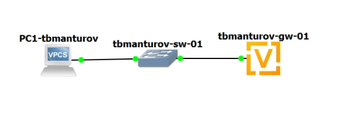{#fig-001 width=70%}

\begin{table}[H]
\centering
\footnotesize
\caption{Таблица адресации (IPv4)}
\label{table:table}
\begin{tabular}{|p{2cm}|p{2cm}|p{3cm}|p{2cm}|p{2cm}|p{2cm}|}
\textbf{Устройство} & \textbf{Интерфейс} & \textbf{IPv4-адрес} & \textbf{Длина префикса} & \textbf{Шлюз по умолчанию} & \textbf{DNS} \\
\hline
gw-01 & eth0 & 10.0.0.1 & 24 & - & - \\ \hline
PC1 & NIC & Назначен протоколом DHCP & 24 (DHCP) & 10.0.0.1 (DHCP) & 10.0.0.1 (DHCP) \\ \hline
\end{tabular}
\end{table}

Запустили GNS3 VM и GNS3. Создали новый проект. В рабочем пространстве разместили и соединили устройства в соответствии с топологией, приведённой на ([рис. @fig-001]). Использовали маршрутизатор VyOS и хост (клиент) VPCS. Включили захват трафика на соединении между коммутатором sw-01 и маршрутизатором gw-01 ([рис. @fig-002])

Настроили образ VyOS. Перешли в режим конфигурирования, изменили имя устройства и доменное имя, заменили системного пользователя, заданного по умолчанию, на нашего пользователя ([рис. @fig-003]), ([рис. @fig-004]):

```
vyos@vyos$ configure
vyos@vyos# set system host-name tbmanturov-gw-01
vyos@vyos# set system domain-name tbmanturov.net
vyos@vyos# set system login user tbmanturov authentication plaintext-password 123456
vyos@vyos# commit
vyos@vyos# save
vyos@vyos# exit
vyos@vyos$ exit
tbmanturov-gw-01 login: tbmanturov
Password:
tbmanturov@tbmanturov-gw-01:~$ configure
tbmanturov@tbmanturov-gw-01# delete system login user vyos
tbmanturov@tbmanturov-gw-01# commit
tbmanturov@tbmanturov-gw-01# save
```

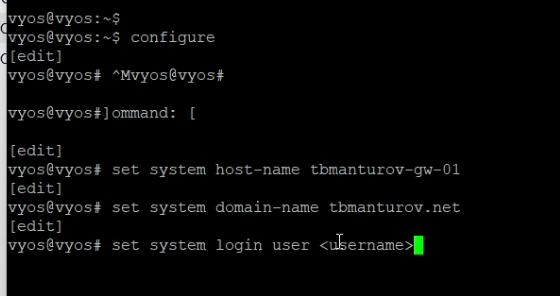{#fig-003 width=70%}

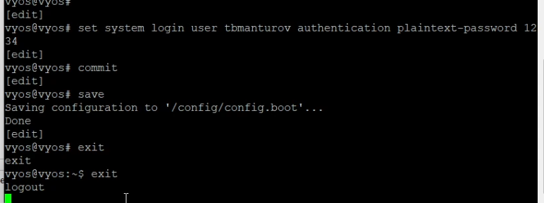{#fig-004 width=70%}

На маршрутизаторе под созданным пользователем перешли в режим конфигурирования, насторили адресацию IPv4 ([рис. @fig-005]): 

```
tbmanturov@tbmanturov-gw-01# set interfaces ethernet eth0 address 10.0.0.1/24
```

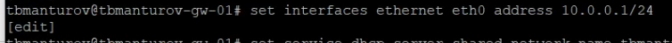{#fig-005 width=70%}

Добавили конфигурацию DHCP-сервера на маршрутизаторе ([рис. @fig-006]): 

```
tbmanturov@tbmanturov-gw-01# set service dhcp-server shared-network-name tbmanturov domain-name tbmanturov.net
tbmanturov@tbmanturov-gw-01# set service dhcp-server shared-network-name tbmanturov name-server 10.0.0.1
tbmanturov@tbmanturov-gw-01# set service dhcp-server shared-network-name tbmanturov subnet 10.0.0.0/24 default-router 10.0.0.1
tbmanturov@tbmanturov-gw-01# set service dhcp-server shared-network-name tbmanturov subnet 10.0.0.0/24 range hosts start 10.0.0.2
tbmanturov@tbmanturov-gw-01# set service dhcp-server shared-network-name tbmanturov subnet 10.0.0.0/24 range hosts stop 10.0.0.253
tbmanturov@tbmanturov-gw-01# commit
tbmanturov@tbmanturov-gw-01# save
tbmanturov@tbmanturov-gw-01# exit
```

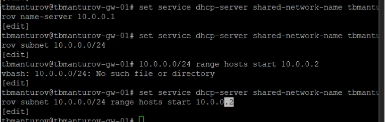{#fig-006 width=70%}

Для просмотра статистики DHCP-сервера и выданных адресов использовали команды ([рис. @fig-007]):

```
tbmanturov@tbmanturov-gw-01$ show dhcp server statistics
tbmanturov@tbmanturov-gw-01$ show dhcp server leases
```

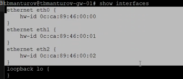{#fig-007 width=70%}

Настроили оконечное устройство PC1 ([рис. @fig-008]), ([рис. @fig-009]):

```
PC1-tbmanturov> ip dhcp -d
PC1-tbmanturov> save
```

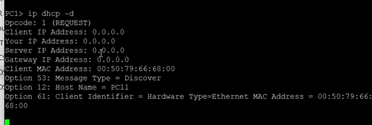{#fig-008 width=70%}

Пояснения к информации полученной на экране PC1: PC1 успешно получил сетевые настройки от DHCP-сервера 10.0.0.1 в подсети 10.0.0.0/24. Все основные параметры (IP, шлюз, DNS) настроены автоматически.

Проверили конфигурацию IPv4 на узле, пропинговали маршрутизатор ([рис. @fig-010]):

```
PC1-tbmanturov> show ip
PC1-tbmanturov> ping 10.0.0.1 -c 2
```

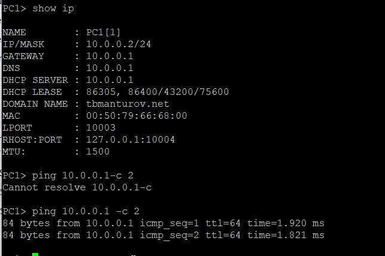{#fig-010 width=70%}

На маршрутизаторе вновь посмотрели статистику DHCP-сервера и выданные адреса ([рис. @fig-011]):

```
tbmanturov@tbmanturov-gw-01$ show dhcp server statistics
tbmanturov@tbmanturov-gw-01$ show dhcp server leases
```

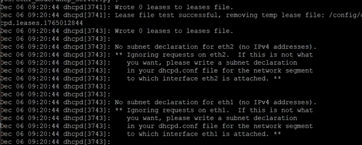{#fig-011 width=70%}

Пояснения: DHCP-сервер работает корректно, выдал один IP-адрес (10.0.0.2) устройству VPCS на 24 часа

На маршрутизаторе посмотрели журнал работы DHCP-сервера ([рис. @fig-012]):

## Настройка DHCP в случае IPv6

Задана топология сети ([рис. @fig-014]) и сведения по адресному пространству сети (табл. 3.2)

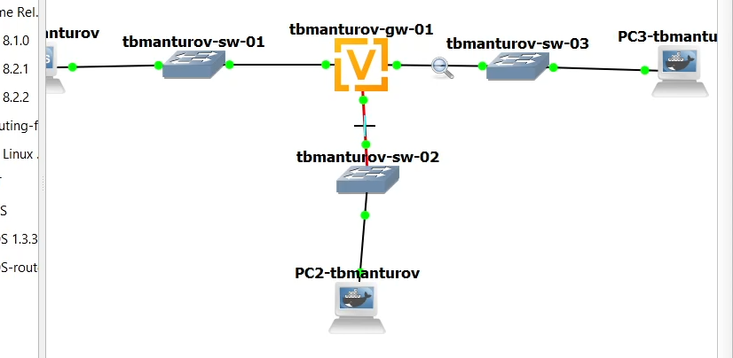{#fig-014 width=70%}

\begin{table}[H]
\centering
\footnotesize
\caption{Таблица адресации (IPv6)}
\label{table:table}
\begin{tabular}{|p{2cm}|p{2cm}|p{3cm}|p{2cm}|p{4cm}|p{2cm}|}
\textbf{Устройство} & \textbf{Интерфейс} & \textbf{IPv6-адрес} & \textbf{Длина префикса} & \textbf{Шлюз по умолчанию} & \textbf{DNS} \\
\hline
gw-01 & eth1 & 2000::1 & 64 & - & - \\ \hline
gw-01 & eth2 & 2001::1 & 64 & - & - \\ \hline
PC2 & NIC & Назначен протоколом SLAAC & 64 (SLAAC) & Назначен протоколом SLAAC & \\ \hline
PC2 & NIC & Назначен протоколами SLAAC и DHCPv6 & 64 & Назначен маршрутизатором &  2000::1 (DHCPv6) \\ \hline
PC3 & NIC & Назначен протоколом DHCPv6 & 64 & Назначен маршрутизатором & 2001::1 (DHCPv6) \\ \hline
\end{tabular}
\end{table}

В предыдущем проекте в рабочем пространстве дополнили сеть, разместив и соединив устройства в соответствии с топологией, приведённой на ([рис. @fig-014]). Использовали хост (клиент) Kali Linux CLI, поскольку клиент VPCS не поддерживает DHCPv6. Включили захват трафика на соединениях между маршрутизатором gw-01 и коммутаторами sw-02 и sw-03 ([рис. @fig-015])

{#fig-015 width=70%}

Настроили адресацию IPv6 на маршрутизаторе ([рис. @fig-016]), ([рис. @fig-017]):

```
tbmanturov@tbmanturov-gw-01:~$ configure
tbmanturov@tbmanturov-gw-01# set interfaces ethernet eth1 address 2000::1/64
tbmanturov@tbmanturov-gw-01# set interfaces ethernet eth2 address 2001::1/64
tbmanturov@tbmanturov-gw-01# show interfaces
tbmanturov@tbmanturov-gw-01# commit
tbmanturov@tbmanturov-gw-01# save
```

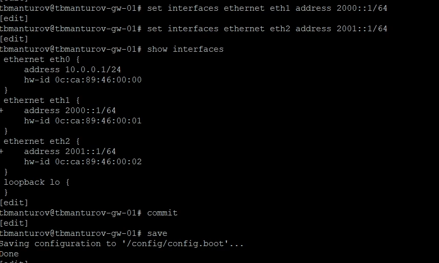{#fig-016 width=70%}

На маршрутизаторе настроили DHCPv6 без отслеживания состояния:

- Настроили объявления о маршрутизаторах ([рис. @fig-018]):

```
tbmanturov@tbmanturov-gw-01# set service router-advert interface eth1 prefix 2000::/64
tbmanturov@tbmanturov-gw-01# set service router-advert interface eth1 other-config-flag
```

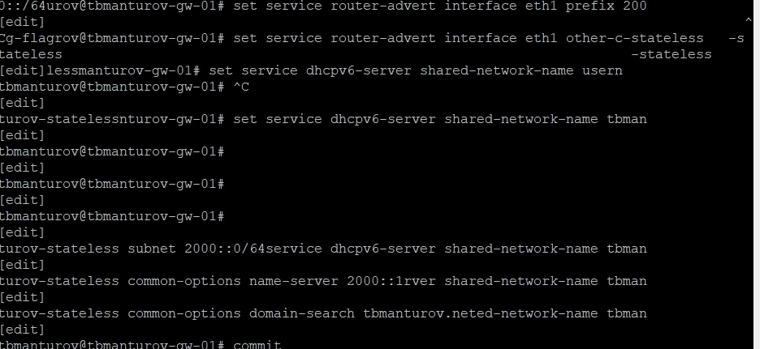{#fig-018 width=70%}

- Добавили конфигурации DHCP-сервера ([рис. @fig-019]), ([рис. @fig-020]): 

```
tbmanturov@tbmanturov-gw-01# set service dhcpv6-server shared-network-name tbmanturov-stateless
tbmanturov@tbmanturov-gw-01# set service dhcpv6-server shared-network-name tbmanturov-stateless subnet 2000::0/64
tbmanturov@tbmanturov-gw-01# set service dhcpv6-server shared-network-name tbmanturov-stateless common-options name-server 2000::1
tbmanturov@tbmanturov-gw-01# set service dhcpv6-server shared-network-name tbmanturov-stateless common-options domain-search tbmanturov.net
tbmanturov@tbmanturov-gw-01# commit
tbmanturov@tbmanturov-gw-01# save
tbmanturov@tbmanturov-gw-01# run show configuration
```

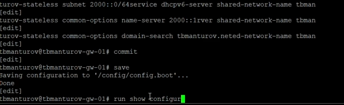{#fig-019 width=70%}

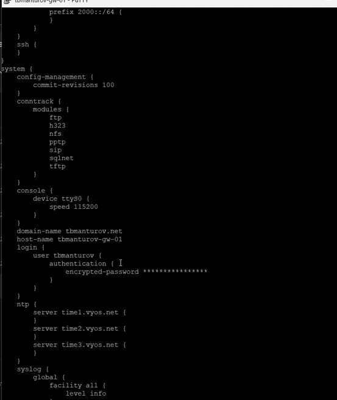{#fig-020 width=70%}

На узле PC2 проверили настройки сети ([рис. @fig-021]), ([рис. @fig-022]):

```
root@PC2-tbmanturov:/# ifconfig
root@PC2-tbmanturov:/# route -n -A inet6
```

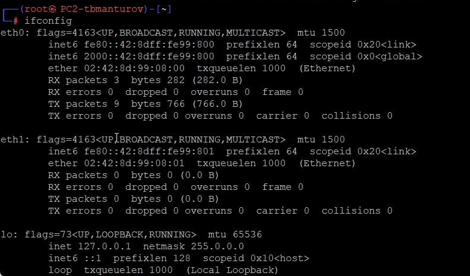{#fig-021 width=70%}

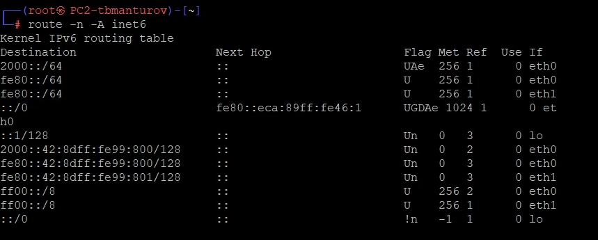{#fig-022 width=70%}

На узле PC2 пропинговали маршрутизатор: ```root@PC2-tbmanturov:/# ping 2000::1 -c 2``` ([рис. @fig-023])

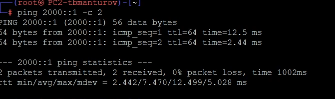{#fig-023 width=70%}

На узле PC2 проверили настройки DNS: ```root@PC2-tbmanturov:/# cat /etc/resolv.conf``` ([рис. @fig-024])

{#fig-024 width=70%}

На узле PC2 получили адрес по DHCPv6: ```root@PC2-tbmanturov:/# dhclient -6 -S -v eth0``` ([рис. @fig-025])

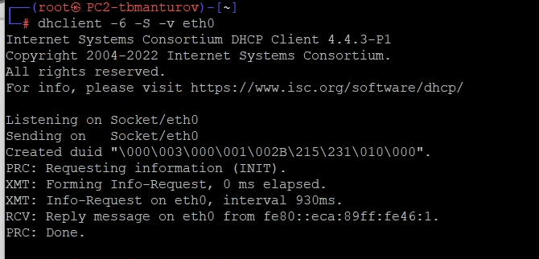{#fig-025 width=70%}

Вновь пропинговали от узла PC2 маршрутизатор, проверили настройки DNS ([рис. @fig-026]), ([рис. @fig-027]):

```
root@PC2-tbmanturov:/# ping 2000::1 -c2
root@PC2-tbmanturov:/# cat /etc/resolv.conf
```

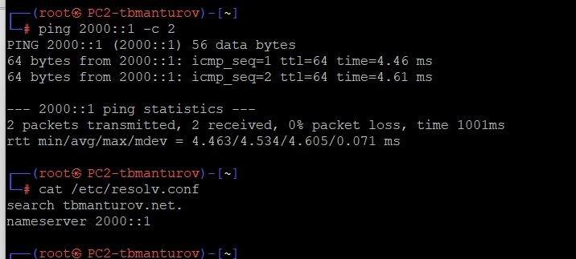{#fig-027 width=70%}

На маршрутизаторе посмотрели статистику DHCP-сервера и выданные адреса: ```tbmanturov@tbmanturov-gw-01# run show dhcpv6 server leases``` ([рис. @fig-028]) 

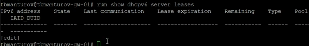{#fig-028 width=70%}

Проанализировали захваченные анализатором трафика пакеты, относящиеся к работе DHCPv6 и назначению адреса устройству ([рис. @fig-029])

{#fig-029 width=70%}

Пояснения: так как используется DHCPv6 без отслеживания состояния, то в пакете нет информации об IPv6 адресе узла PC, потому что не происходит выделения конкрентного адреса узлу, что также приводит к отсутствию записи в статистике DHCP-сервера.

На маршрутизаторе настроили DHCPv6 с отслеживанием состояния:

- На интерфейсе eth2 маршрутизатора настроили объявления о маршрутизаторах ([рис. @fig-030]):

```
tbmanturov@tbmanturov-gw-01# set service router-advert interface eth2 managed-flag
```

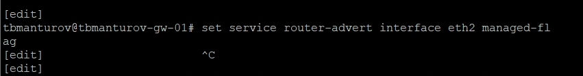{#fig-030 width=70%}

- Добавили конфигурацию DHCP-сервера на маршрутизаторе ([рис. @fig-031]):

```
tbmanturov@tbmanturov-gw-01# set service dhcpv6-server shared-network-name tbmanturov-stateful
tbmanturov@tbmanturov-gw-01# set service dhcpv6-server shared-network-name tbmanturov-stateful subnet 2001::0/64
tbmanturov@tbmanturov-gw-01# set service dhcpv6-server shared-network-name tbmanturov-stateful subnet 2001::0/64 name-server 2001::1
tbmanturov@tbmanturov-gw-01# set service dhcpv6-server shared-network-name tbmanturov-stateful subnet 2001::0/64 domain-search tbmanturov.net
tbmanturov@tbmanturov-gw-01# set service dhcpv6-server shared-network-name tbmanturov-stateful subnet 2001::0/64 address-range start 2001::100 stop 2001::199
tbmanturov@tbmanturov-gw-01# commit
tbmanturov@tbmanturov-gw-01# save
```

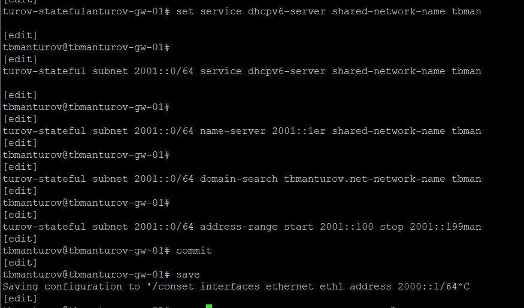{#fig-031 width=70%}

На маршрутизаторе посмотрели статистику DHCP-сервера и выданные адреса: ```tbmanturov@tbmanturov-gw-01# run show dhcpv6 server leases``` ([рис. @fig-032])

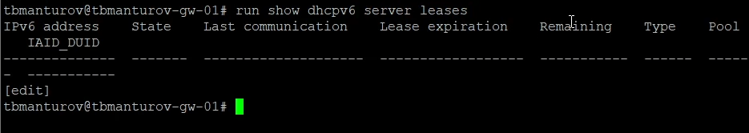{#fig-032 width=70%}

Подключились к узлу PC3 и провериои настройки сети ([рис. @fig-033]), ([рис. @fig-034]):

```
root@PC3-tbmanturov:/# ifconfig
root@PC3-tbmanturov:/# route -n -A inet6
```

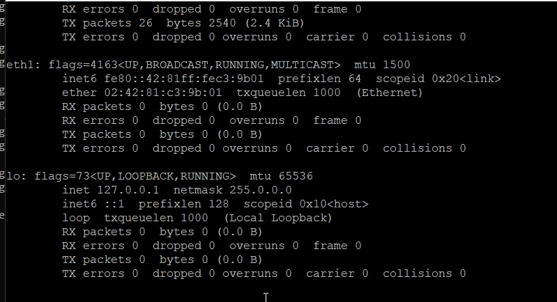{#fig-033 width=70%}

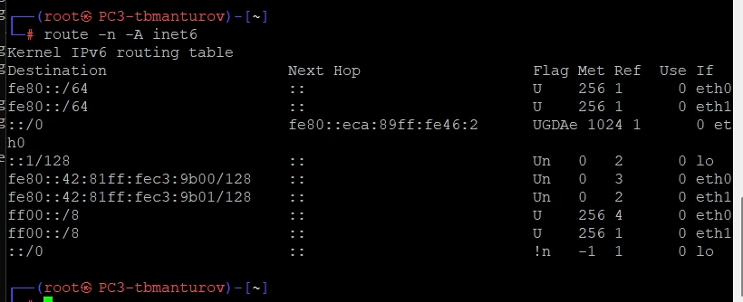{#fig-034 width=70%}

На узле PC3 проверьте настройки DNS: ```root@PC3-tbmanturov:/# cat /etc/resolv.conf``` ([рис. @fig-035])

{#fig-035 width=70%}

На узле PC3 получили адрес по DHCPv6: ```root@PC3-tbmanturov:/# dhclient -6 -v eth0```  ([рис. @fig-036])

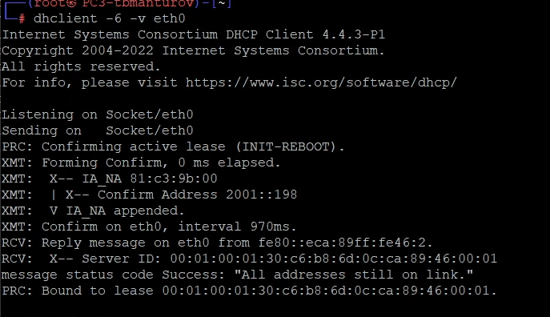{#fig-036 width=70%}

Вновь на узле PC3 проверили настройки сети ([рис. @fig-037]), ([рис. @fig-038])

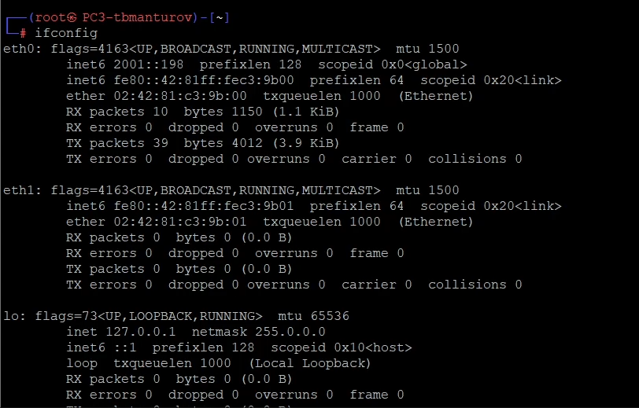{#fig-037 width=70%}

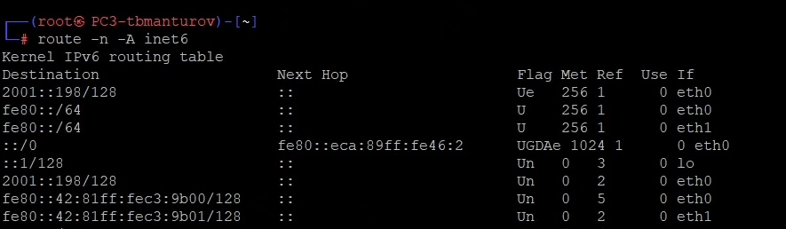{#fig-038 width=70%}

Пропинговали от узла PC3 маршрутизатор, проверили настройки DNS ([рис. @fig-039]), ([рис. @fig-040]):

```
root@PC3-tbmanturov:/# ping 2001::1 -c2
root@PC3-tbmanturov:/# cat /etc/resolv.conf
```

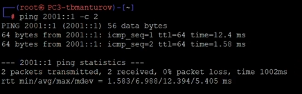{#fig-039 width=70%}

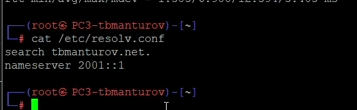{#fig-040 width=70%}

На маршрутизаторе посмотрели статистику DHCP-сервера и выданные адреса: ```tbmanturov@tbmanturov-gw-01# run show dhcpv6 server leases``` ([рис. @fig-041])

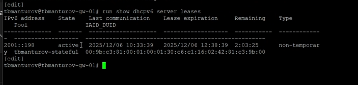{#fig-041 width=70%}

Пояснения: так как используется DHCPv6 с отслеживанием состояния, то в пакете содержится
информация об IPv6 адресе узла PC3

# Выводы

В ходе выполнения лабораторной работы №7 мы получили навыки настройки службы DHCP на сетевом оборудовании для распределения адресов IPv4 и IPv6.


# Список литературы

1. [Лаборатораня работа №7](https://esystem.rudn.ru/pluginfile.php/2858383/mod_resource/content/1/007-lab_ipv4-ipv6-dhcp-GNS3.pdf)
